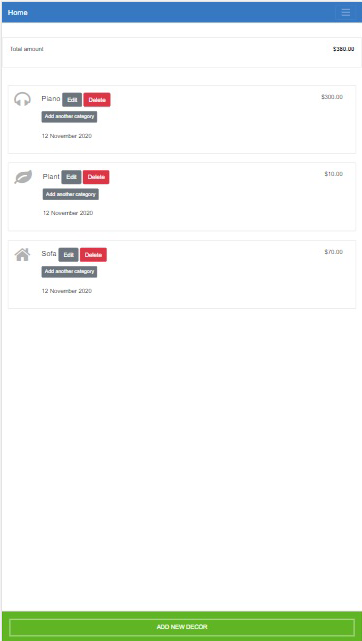
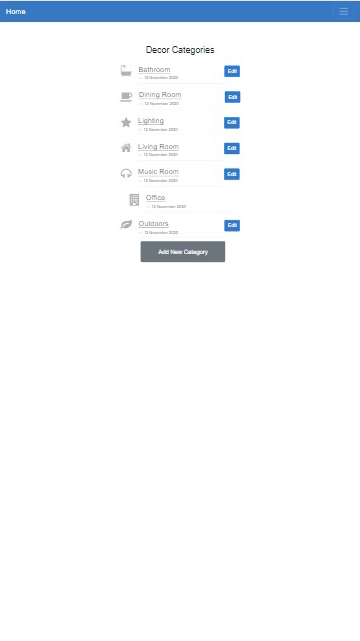
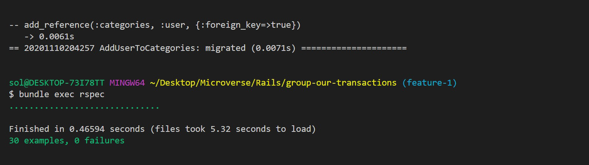

#  🧐 Group Our Transactions (Mobile App)

this is an app made specially for mobiles, is an app that groups payments of decorations bought for designing specific sections of a home. The decorations or decors are divided into categories of specific rooms of a home. Example living room, bathroom, kitchen, etc. 

Is a mobile app for grouping decor payments according to your categories of choice.


## Mobile Views 




## 🔴 Demos

[Live Demo](https://group-our-transactions.herokuapp.com/)

[Video Demo](https://drive.google.com/file/d/1jWASAz97ByhsPhR8Q_dEvMsqCx-SCd-G/view?usp=sharing)

## Tests with RSpec 

This website was tested with [Rspec](https://en.wikipedia.org/wiki/RSpec) wich is a computer domain-specific language (DSL) testing tool written in programming language Ruby to test Ruby code. It is a behavior-driven development (BDD) framework which is extensively used in production applications. 

## Install rspec-rails gem
- In a terminal window type ```gem install rspec-rails``` or simply add the gem to your Gemfile and run ```bundle install```, this last choice is the recomended way of doing it.
- Once rspec install has finished, go to project directory and type ```rails generate rspec:install``` 
- You will see a folder ```spec``` and a files ```rails_helper.rb``` and ```spec_helper.rb``` created inside that folder.
- You can generate a spec test for your models with this command ```rails generate rspec:model model-name```.

## Run Rspec 
- Open a terminal window and type ```bundle exec rspec``` command
- All tests should have passed 


## 🔧 Built With these features
- Ruby. v2.6.6
- Ruby on Rails. v6.0.3
- Using Rubocop Linters.
- Bootstrap

## 🛠 Getting Started
## Install 
 In order to run on the local environment, you need to install Ruby on your computer. For windows, you can go to [Ruby installer](https://rubyinstaller.org/) and for MAC and LINUX you can go to [Ruby official site](https://www.ruby-lang.org/en/downloads/) for instructions on how to install it. Then you can clone the project by typing ```git clone https://github.com/Ceci007/group-our-transactions.git``` on your terminal.

## Run the application
To get a local copy up and running follow these simple example steps.

- Open a terminal
- Copy this code : ```git clone "put the link from github repo"```
- Run the program with this code : ```bundle install```
- before running ```rails server``` you must run a few more commands: first run ```yarn install --check-files```
- Then run ```rails db:create```, ```rails db:migrate```
- now you can run ```rails server```
- Stop the program with: "Ctrl + C" (Windows or Linux) or "Command + C"(Apple)

## Open app in browser

- When the program is running go to your browser.
- put: localhost:3000/
- Click on Sign Up, then register and create a new Category or Decor.
- Enjoy the app.

## ✒️ Authors
👤 **Cecilia Benitez Casaccia**

- Github: [@Ceci007](https://github.com/Ceci007)
- LinkedIn:[LinkedIn](www.linkedin.com/in/cecilia-benítez)

## 🤝 Contributing
Contributions, issues and feature requests are welcome!

Feel free to check the [issues page](https://github.com/Ceci007/group-our-transactions/issues).

## 📝 License
This project is [MIT](lic.url) licensed.